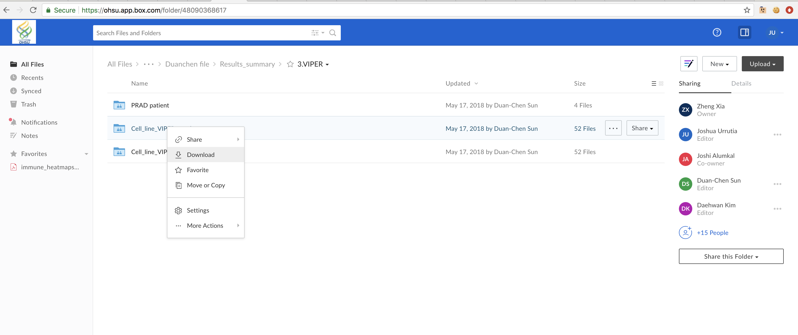
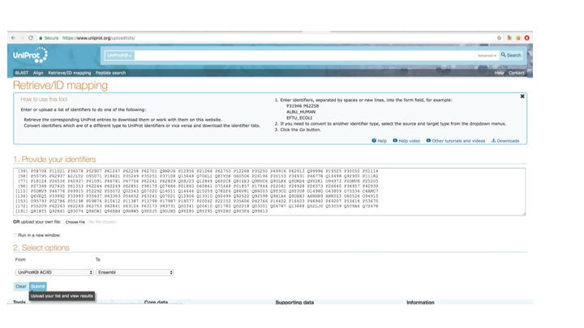
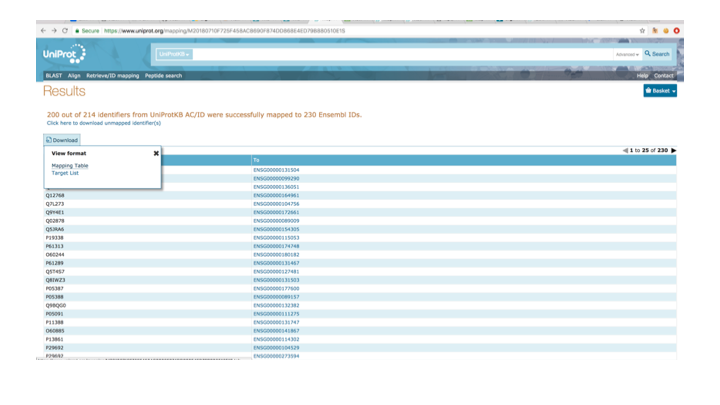

# Advanced Integrations

Occasionally you will need to integrate datasets that use different identifiers, or integrate a whole bunch of different dataframes. In this section we'll review common identifier conversions, and how to use loops and the `reduce` function to merge multiple dataframes.

### Loops
A loop is a piece of code that wraps around itself. Be careful when creating loops that your loop does not go on forever. A simple example is a loop that prints a value for every element in a list. For example:
```r
list1 <- c("a","b","c","d","e")

for (element in list1) {
  print(element)
}
```
The above loop prints out elements of `list1` and stops when it gets to the end of the list. Loops can be really useful for integrating data. Let's download an entire folder full of files, run a loop to load the files into R, and filter for statistically significant results. Right click to download the entire [Cell_line_VIPER_regulon folder](https://ohsu.box.com/s/d9gsmf97oetki9y4vim96hflk85wx76u) from box, unzip it, and set it as your working directory.



```r
file_list = list.files(pattern="*.txt")      # lists all the files in your working directory that end in '.txt'

for (file in file_list) {
   assign(file, read.table(file, header = TRUE))    # reads the file as an R object with the same file name
   d=get(file)                                      # uses a temporary dataframe, d, instead of the file
   d <- d[d$p.value < 0.05,]                        # filters the dataframe for stastically significant MRs
   names(d)[names(d) == 'NES'] <- file              # renames the NES column to be the same name as the file
   d <- d[,c("Regulon",file)]                       # saves only the regulon name, and the NES column and gets rid of other columns
   assign(file,d)                                   # saves the dataframe d under the original file name
}
```

Now that we have all of our files imported and filtered for significance, we can merge them all into a single dataframe. First lets run a couple of simple commands to spit out the list of files separated by commas:
```r
strlist <- paste(file_list, collapse = ",")   # creates a comma-seperated list of the files
noquote(strlist)                               # prints the comman-seperated list without quotes around the file names
```

Now that we have the file names without quotes (remember R objects don't have quotes around them), we can copy/paste those into the `Reduce` function. Basically what's happening here is were are using `Reduce` to iterate over the merge function and performing an outer join so we save all values (`all=TRUE`).

```r  
all_MRs <- Reduce(function(x,y) merge(x,y, all=TRUE), list(Cx_12wk_vs_Pre_Cx.txt,Cx_8wk_vs_Pre_Cx.txt,LNCaP_APIPC_vs_LNCaP_APIPC_R1881.txt,LNCap_MDV_vs_LNCaP_Veh.txt,LNCaP_shAR_vs_LNCaP_shAR_R1881.txt,MR42D_666_15_vs_MR42D_Veh.txt,MR42D_ARV_771_vs_MR42D_Veh.txt,MR42D_JQ1_vs_MR42D_Veh.txt,MR42D_SP2509_vs_MR42D_Veh.txt,MR42D_Washout_MDV_vs_LNCaP_Veh.txt,MR42D_Washout_MDV_vs_MR42D_Washout_Veh.txt,MR42D_Washout_MDV_vs_V16D_Veh.txt,MR42F_MDV_vs_MR42F_Washout_Veh.txt,MR42F_Washout_MDV_vs_LNCaP_Veh.txt,MR42F_Washout_MDV_vs_MR42F_Washout_Veh.txt,MR42F_Washout_MDV_vs_V16D_Veh.txt,MR49F_MDV_vs_LNCaP_Veh.txt,MR49F_MDV_vs_MR49F_veh.txt,MR49F_MDV_vs_V16D_Veh.txt,Relapsed_vs_Cx_12wk.txt,Relapsed_vs_Cx_8wk.txt,Relapsed_vs_Pre_Cx.txt,siBRD4_vs_siNTC.txt,siCREB1_vs_siNTC.txt,siEP300_vs_siNTC.txt,V16D_MDV_vs_V16D_Veh.txt))

write.table(all_MRs, "Statistically_significant_MRs.txt", col.names = TRUE, row.names = FALSE, sep = '\t')
```

Using a reduce/merge combination like this can be problematic if the field that you are joining on is non-unique (like gene names in ChIP data), because the number of rows grows exponentially with each dataframe that is merged. However, for these VIPER MRs, each regulon only appears once per dataframe, so we don't need to worry about multiplying rows.


Now lets import another dataframe. We want to integrate these MRs with the MR/AR-score correlations that Alana generated.
<a href="../Alana_Analysis.txt" download>Download Alana's MR Correlations</a>
```r
Alana_Analysis <- read.delim("~/Downloads/Alana_Analysis.txt")       # read in dataframe
Alana_Analysis <- Alana_Analysis[Alana_Analysis$pval < 0.05,]        # filter for significance
Alana_Analysis <- Alana_Analysis[,c("Regulon","AR_Correlation")]     # keep only regulon and AR_Correlation columns
final <- merge(Alana_Analysis, all_MRs, all.x = TRUE)                # merge two datasets, keeping whats in Alana's analysis
final <- unique(final)                                               # gets rid of duplicated rows
final <- final[rowSums(is.na(final)) != ncol(final),]                # gets rid of na rows
rownames(final) <- final[,1]                                         # renames row
```
Now that we've merged Alana's correlation scores with the VIPER MR scores, let use another loop to create some new columns. This loop adds on a new column (named `direction.file_name`) for every VIPER MR column. There is some logic so that it assigns the value "same" if the MR is going in the same direction as Alana's AR correlation, and "different" if the MR score is in the opposite direction as the AR correlation.
```r
for (file in file_list) {
  final[[paste("direction", file ,sep=".")]] <- ifelse((final$AR_Correlation * final[[file]] > 0),"same", "different")
}
```
And now we can save the dataframe:
```r
write.table(final, "Alana_Correlation_VIPER_MR_overlap.txt", col.names = TRUE, row.names = FALSE, sep = '\t')
```

### Working with Uniprot Ids
Data that we get back from proteomics, namely mass-spec data, often has Uniprot accession Ids and Uniprot gene names as identifiers. While there are many genes that have the same Uniprot and Ensembl gene name, there are a significant number of genes that have different identifiers. When integrating mass spec and HTS data, it is best to convert gene identifiers to a common format. We'll convert Uniprot gene names to Ensembl gene names, and integrate proteomics data with our RNA-seq.

Download the BRD4 mass spec data, load it into R, and print out the Uniprot accession numbers:

<a href="../BRD4_DSG_Mass_Spec.txt" download>Download BRD4 Mass Spec</a>
```r
BRD4_DSG_Mass_Spec <- read.delim("~/Downloads/BRD4_DSG_Mass_Spec.txt")

BRD4_DSG_Mass_Spec$Accession
```
Copy and paste the accession numbers into the [Uniprot ID mapping tool](https://www.uniprot.org/uploadlists/). Select UniProtKB AC/ID in the From field, and Ensembl in the To field, and click submit.



Next, click download, and select mapping table.



Now select save as in your browser, and save the mapping table as `uniprot_ids.txt`. Import this table into R and merge with the `BRD4_DSG_Mass_Spec` dataframe:

```r
uniprot_ids <- read.delim("~/Downloads/uniprot_ids.txt")
BRD4_DSG_Mass_Spec <- merge(BRD4_DSG_Mass_Spec, uniprot_ids, by.x = 'Accession', by.y = 'From')
```

Now every row of `BRD4_DSG_Mass_Spec` has a column called `To`, that contains the ensembl ID for that gene.

Next, we'll need to re-add Ensembl Ids to the siBRD4 heatmap we created. Let's do this with the R package `BiomaRt`. First we'll download boimart, and create a biomart object called ensembl:
```r
source("https://bioconductor.org/biocLite.R")
biocLite("biomaRt")
library(biomaRt)
ensembl = useMart("ensembl",dataset="hsapiens_gene_ensembl")
```

Next, we'll use a biomart query `getBM`, to create a dataframe called `hm_ensembl_mapping` which contains HGNC symbols and ensembl Ids for every gene symbol in our `de_heatmap` dataframe. Then we'll merge `hm_ensembl_mapping` and `de_heatmap` to annotate our heatmap.

```r
hm_ensembl_mapping <- getBM(attributes=c("hgnc_symbol","ensembl_gene_id"), filters= 'hgnc_symbol', values = de_heatmap$Gene_Symbol, mart=ensembl)
de_heatmap <- merge(de_heatmap, hm_ensembl_mapping, by.x = 'Gene_Symbol', by.y = "hgnc_symbol")
```
And finally we can use merge to do an inner join of our heatmap and our mass spec data:
```r
Mass_spec_DE_genes <- merge(de_heatmap, BRD4_DSG_Mass_Spec, by.x= 'ensembl_gene_id', by.y = 'To')
```

Now we have a dataframe `Mass_spec_DE_genes`, that includes log2FC values and mass spec counts for BRD4.

## Closing Remarks
Congratulations on completing this R workshop! I know there's a lot to take in from the past two days, but hopefully this website will be a useful resource for you when working with R in the future. Don't be afraid to try new things, you will fail, corrupt data, and get frustrating errors, but as you become more comfortable with R you'll be able to explore and visualize the data in new and interesting ways. Feel free to reach out to me if you have any questions, and good luck!

Previous: [Heatmaps](heatmaps.md)|Top: [Course Overview](../index.md)
